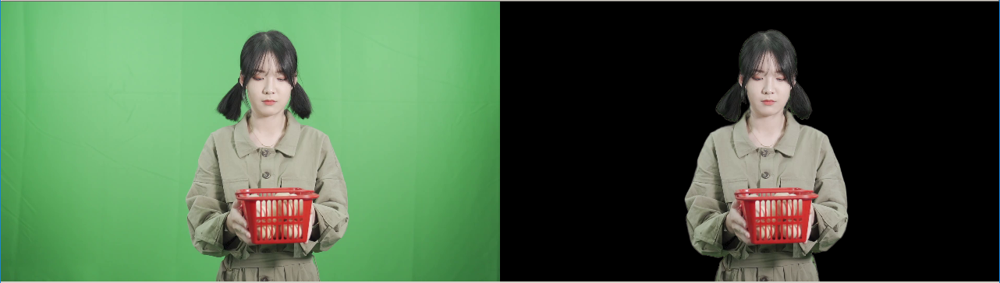

# Video Unscreen



## Introduction
This repo provides two unscreen techniques: 1) green mat video unscreen and 2) unscreen with background estimation, and one people replacement application based on them.

### Notice
These techniques are developed in <em>2020</em> though the paper is accepted in <em>2022</em>.
A much more advanced version of this project has been successfully used in [SenseAIGC](https://aigc.sensetime.com/).

## Installation
Please refer to [INSTALL.md](docs/INSTALL.md) for installation and dataset preparation. Pretrained models and dataset are also explanined here.


## Running Scripts
### Unscreen

#### Modes
Under `tools/unscreen`, there are three unscreen modes 

```shell
|-tools/unscreen
|   |-bg # online background estimation
|   |-bg_step # offline background estimation with an overall background 
|   |-green # online green matting
```

#### Running
```shell
# Video unscreen
bash tools/unscreen.sh ${script} ${src} ${gpuid}
# For example
bash tools/unscreen.sh bg_step 0002 2

# Video unscreen in parallel
python unscreen_parallel.py --script ${script} --range ${src}-${src} --gpuid ${gpuid}
# For example
python unscreen_parallel.py --script bg_step --range 0-10 --gpuid 2

# Evalutaion
python tools/eval.py
```

### Replace
```shell
# Person replacement
bash tools/replace.sh ${script} ${src} ${tgt}
# For example
bash tools/replace.sh replace test3 out3
```

## Citation
```
@article{rao2022coarse,
    title={A Coarse-to-Fine Framework for Automatic Video Unscreen},
    author={Rao, Anyi and Xu, Linning and Li, Zhizhong and Huang, Qingqiu and Kuang, Zhanghui and Zhang, Wayne and Lin, Dahua},
    journal={IEEE Transactions on Multimedia},
    year={2022},
    publisher={IEEE}
}
```
